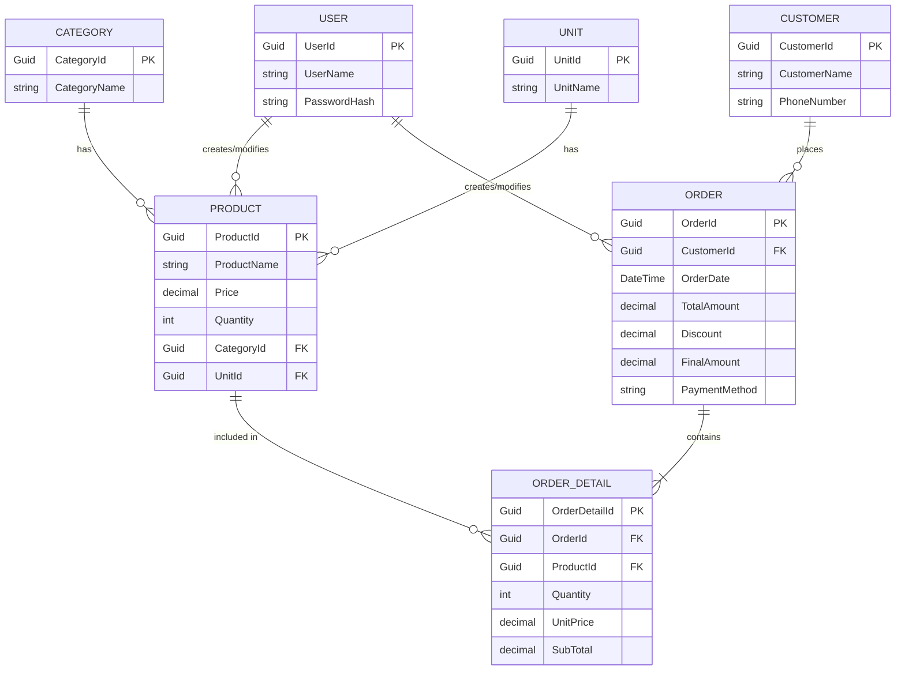

# Hệ Thống Quản Lý Cửa Hàng Gốm Sứ (VDCD)

Hệ thống Full-stack quản lý bán hàng bao gồm Backend viết bằng **C# (.NET 8 API + EF Core + PostgreSQL)** và Frontend viết bằng **React (Vite)**.

---

## 1. Hướng dẫn cách chạy chương trình

### Backend (C# - .NET API)
1. Mở thư mục chứa code backend (VDCD.API):
   ```bash
   cd VDCD.API
   ```
2. Cập nhật chuỗi kết nối (`ConnectionString`) tới database PostgreSQL trong tệp `VDCD.API/appsettings.json` cho phù hợp với môi trường local của bạn.
3. Cập nhật database bằng Entity Framework Core Migrations (nếu database chưa được tạo):
   ```bash
   dotnet ef database update --project VDCD.DL --startup-project VDCD.API
   ```
4. Khởi chạy ứng dụng:
   ```bash
   dotnet run --project VDCD.API
   ```
   > API sẽ mặc định chạy trên cổng `https://localhost:7231` (hoặc cấu hình port tương ứng hiển thị trên terminal).
6. **Thêm dữ liệu mẫu (Seed Data) để test thử:**
   - Trong thư mục gốc của dự án, mình đã chuẩn bị sẵn một tệp tên là `seed_data.sql`.
   - Sau khi Database đã được tạo ở Bước 4, hãy mở tệp `seed_data.sql` này, copy toàn bộ nội dung và chạy (Execute) trong công cụ quản lý PostgreSQL của bạn (như pgAdmin, DBeaver, hoặc chạy qua CLI).
   - Việc này sẽ cung cấp sẵn: **1 tài khoản (admin/admin)**, một số **Loại sản phẩm**, **Đơn vị tính** và **Sản phẩm mẫu** để bạn có thể sử dụng giao diện Frontend và thực hiện chức năng Bán hàng ngay lập tức.

### Frontend (React + Vite)
1. Mở thư mục Client:
   ```bash
   cd Client
   ```
2. Cài đặt các thư viện phụ thuộc (Node.js required):
   ```bash
   npm install
   ```
3. Khởi chạy giao diện ở chế độ Development:
   ```bash
   npm run dev
   ```
4. Truy cập trình duyệt ở địa chỉ `http://localhost:5173`.

---

## 2. Mô tả các bảng Database đã thiết kế

Hệ thống sử dụng EF Core (Code-First) để xây dựng cấu trúc CSDL PostgreSQL, bao gồm các bảng chính:

- **`User`**: Quản lý tài khoản đăng nhập của nhân viên/quản trị viên.
- **`Category`**: Lưu trữ các loại sản phẩm (ví dụ: Gốm Bát Tràng, Gốm Chu Đậu,...).
- **`Unit`**: Quản lý các đơn vị tính (Cái, Bộ, Chiếc,...).
- **`Product`**: Bảng trung tâm chứa thông tin chi tiết về từng mặt hàng (Tên, Giá, Tồn kho, Mô tả), được liên kết Khóa Ngoại (`FK`) với `Category` và `Unit`.
- **`Customer`**: Lưu thông tin khách hàng mua hàng (Tên, SĐT).
- **`Order`**: Thông tin tổng quan của một hóa đơn (Tổng tiền, giảm giá, thành tiền, phương thức thanh toán, thời gian mua).
- **`OrderDetail`**: Lưu chi tiết từng mặt hàng nằm trong hóa đơn (Id sản phẩm, Số lượng, Đơn giá lúc bán).

### Sơ đồ ERD (Entity-Relationship Diagram)



---

## 3. Danh sách các API & Chức năng đã hoàn thành

### API Backend (RESTful)

*   **Xác thực (Auth):**
    *   `POST /api/Users/login`: Xác thực tài khoản người dùng và trả về thông tin.
*   **Danh mục cơ sở (Master Data):**
    *   `GET /api/Categories` & `GET /api/Categories/{id}`: Truy xuất Loại sản phẩm.
    *   `GET /api/Units` & `GET /api/Units/{id}`: Truy xuất Đơn vị tính.
*   **Quản lý Sản phẩm (Product Management):**
    *   `GET /api/Products`: Lấy danh sách toàn bộ sản phẩm.
    *   `POST /api/Products`: Thêm sản phẩm mới (Tự động tracking `CreatedBy`).
    *   `PUT /api/Products/{id}`: Cập nhật sản phẩm (Tự động tracking `ModifiedBy`).
    *   `DELETE /api/Products/{id}`: Xóa sản phẩm (Có kiểm tra bảo vệ toàn vẹn dữ liệu nếu đã phát sinh hóa đơn).
*   **Quản lý Bán hàng (Sales):**
    *   `GET /api/Sales`: Lấy danh sách hóa đơn.
    *   `POST /api/Sales`: Tạo hóa đơn mới (Xử lý giao dịch trừ tự động tồn kho, tính tổng tiền, tạo mới khách hàng).
*   **Báo cáo Thống kê (Statistics):**
    *   `GET /api/Statistics/category-sales`: Thống kê sản lượng bán ra theo từng Loại sản phẩm trong 1 khoảng thời gian.
    *   `GET /api/Statistics/product-revenue/{id}`: Tra cứu tổng doanh thu và số lượng tiêu thụ của một Sản phẩm cụ thể.

### Giao diện Frontend (React)

*   **Màn hình Đăng nhập:** Cho phép đăng nhập vào hệ thống và lưu trữ phiên hoạt động.
*   **Quản lý Sản phẩm:** 
    *   Hiển thị dạng bảng (Table) đẹp mắt với tính năng tự động rút gọn nội dung dài `...`.
    *   Form thêm/sửa sản phẩm hiện đại, hiển thị tiền tệ định dạng chuẩn Việt Nam (VD: `10.000 đ`).
*   **Module Bán Hàng (POS):** 
    *   Cho phép tạo đơn hàng nhanh, tự động chặn không cho chọn trùng 1 mặt hàng nhiều lần.
    *   Cửa sổ (Modal) chi tiết hóa đơn hiển thị đầy đủ thông tin Khách hàng, Sản phẩm, Tổng tiền, và Người tạo.
*   **Module Thống kê:** 
    *   Form chọn `datetime-local` giúp lọc thời gian chính xác.
    *   Hiển thị trực quan doanh thu từng sản phẩm và sản lượng các mặt hàng.
